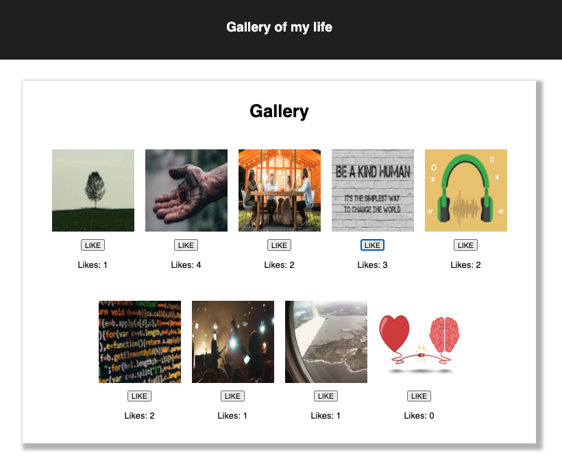

# Gallery Of My Life

## Description

_Duration: 30 Hour Sprint_

Gallery Of My Life displays images, updates the "Like" click count, through the backend.

Application displays various properties of the images.

Properties of employee include:

- Title
- Description
- Like Count

<!-- The application stores the data and is displayed on the DOM. User is able to
delete each record indivigalley_ssdually by clicking a button.

If the total monthly costs of all employees is greater than \$20,000 the total is highlighted in red. -->

## Screen Shots

### Prerequisites

None

## Installation

1. Fork and Clone repo from GitHub and open in your favorite editor and browser. Must have react installed.

## Usage

1. Organize photos and capture like interaction.

## Built With

- macOS Catalina
- Google Fiber Internet
- Visual Studio Code v1.46.1
- HTML5
- CSS 3
- Postman v7.28.0

Frameworks

- React (arguable)

Languages

- JavaScript

Libraries

- React

## Acknowledgement

Thanks to [Prime Digital Academy](www.primeacademy.io) who equipped and helped me to make this application a reality.

## Support

If you have suggestions or issues, please email me at [RyanGregoryCodes@gmail.com](www.google.com)
